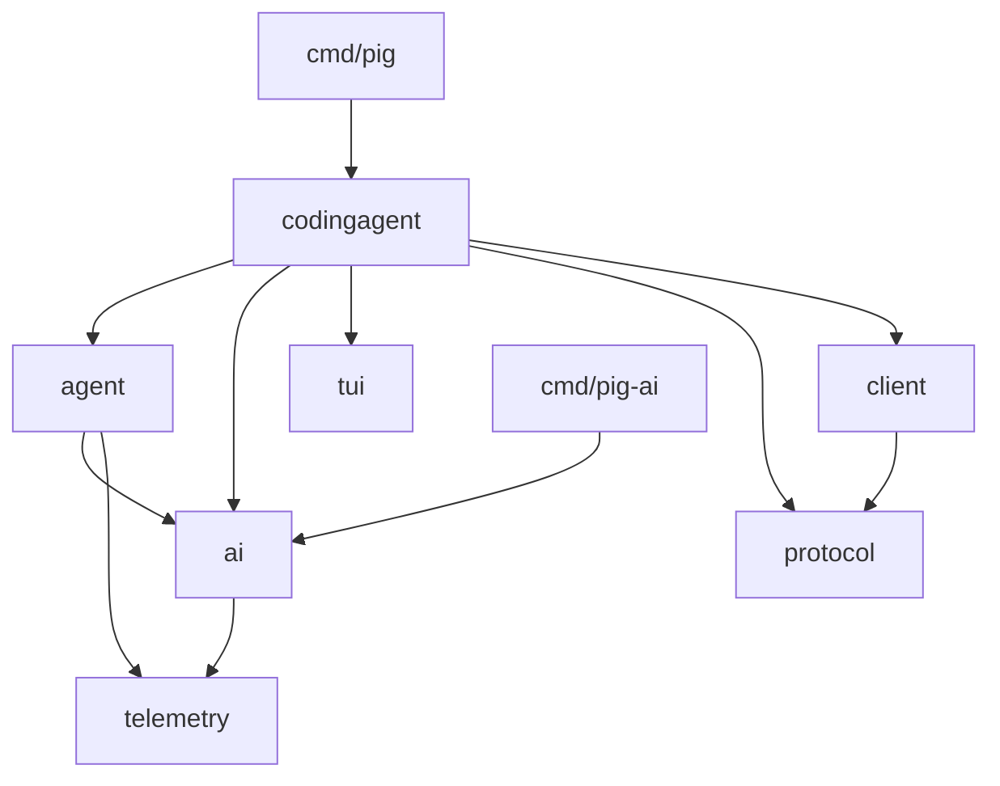

# Pig 架构

## 目标与边界

Pig 是 Pi 固定快照在已批准原生 Go 兼容面内的完整复刻，不是功能精简版，也不是基于 Pi 思路重新设计的产品。V1 的主目标是完整复刻三个 Core Module：`ai`、`agent`、`coding-agent`；为了保持它们的真实分层和运行语义，同时完整复刻四个 Supporting Module：`telemetry`、`tui`、`protocol`、`client`。Pi 的 browser/Worker/WASM 表面是已明确排除并登记的范围偏离，不能计入 native parity，也不能因此缩减七个模块的原生能力。

V1 不包含 Pi 的 `server`、`evals` 和 `session-backends/sqlite-node`。`protocol`、`client` 与远程会话仍需实现，并通过固定 server package 的测试 host/受控 service 和 fake server 验证互操作，但不能据此宣称 Pig 已提供 Server 或假设上游存在 standalone Coding Agent Server。

## 单一 Go module

仓库使用一个 Go module：

```text
github.com/nankedr/pig
```

顶层包保持七个模块边界：

```text
ai/
agent/
codingagent/
telemetry/
tui/
protocol/
client/
cmd/pig/
cmd/pig-ai/
```

Go package 名使用 `codingagent`，但文档在指代 Pi 上游模块时保留 `coding-agent`。七个包统一版本、统一发布，不建立多个 Go module。文件可以按 Go 语言习惯合并或拆分，不要求 TypeScript 文件与 Go 文件一一对应；包边界、子系统边界、依赖方向、状态机和算法必须可追溯到 Pi。

## 依赖方向

箭头表示“依赖”：



依赖只能向图中的底层方向流动，不能为了便于接线引入反向依赖或循环。命令包负责组装，不承载可复用领域逻辑；`codingagent` 负责产品编排，不把 Provider 协议、通用 Agent Loop 或终端渲染重新实现一遍。

## 七个模块的职责

| 包 | 职责 | 不负责 |
| --- | --- | --- |
| `telemetry` | 开放的 `TelemetryContext`、`TelemetrySpan`、动态 schema、NOOP、无界内存参考实现和 adapter conformance | 默认 exporter、全局当前 span、产品安装上报 |
| `ai` | Message/Content、Model、Provider、API Adapter、认证、模型与图片目录、EventStream、重试、usage/cost、协议转换 | Agent 历史、Tool 调度、CLI |
| `agent` | legacy `Agent`、Agent Loop、Tool 执行、队列、事件，以及 `AgentHarness` v4 路径 | 会话产品体验、TUI、Provider 目录所有权 |
| `codingagent` | `AgentSession`、会话/设置/资源/包、默认 Tool、Headless/RPC/Interactive 模式、扩展边界 | 重复实现 `ai`、`agent`、`tui`、`protocol` 或 `client` 的底层能力 |
| `tui` | 终端、布局、组件、编辑器、按键、主题、图片与输入解析 | Coding Agent 业务状态 |
| `protocol` | schema、CBOR、framing 和跨进程 wire value | 连接生命周期和产品状态 |
| `client` | transport、连接、请求关联、快照、Session Handle 和取消 | Server 实现、持久化后端 |

Telemetry schema 在运行时保持开放并可校验；Pig 自带的 AI 与 Harness schema 由声明生成强类型 Go helper。第三方可以直接使用动态 API，也可以显式生成 helper，不能手工模拟 TypeScript 条件类型。

`telemetry` Supporting Module 与 Coding Agent 的 install telemetry 必须严格区分。前者是显式传递、默认 NOOP、没有 exporter 或 endpoint 的诊断契约；后者是产品层的可选安装上报外联面，属于 `codingagent` 的产品策略。Pig 的安装上报只能显式 opt-in，并且没有 Pig 自有或用户配置 endpoint 时保持禁用，不能把它接到 Pi 运营服务。

## 双 Agent 架构

Parity Baseline 同时包含两条 Agent 路径，Pig 必须保持这一事实。

### 生产路径

生产 Coding Agent 使用：

```text
legacy Agent -> AgentSession -> v3 JSONL
```

M1 的 Headless Coding Agent、后续 TUI、RPC、会话恢复、压缩和分支都沿用此路径。Pig 不提前把生产路径迁移到 Harness。

### Harness 路径

新路径使用：

```text
AgentHarness -> v4 Session/Reducer/Compaction substrate
```

Pig 复刻固定快照已经实现的 v4 持久化底座、类型和行为，也保留固定快照明确返回未实现的操作。不能根据上游设计文档自行补完未来功能，也不能让 Harness v4 暗中读取 v3 数据。

这两条路径可以复用 `ai`、Tool 定义和基础类型，但不能通过抽象合并而抹去不同的状态模型、持久化格式和完成度。

## 核心运行契约

### EventStream

Pi 的事件流是无背压队列并带有独立最终结果。Pig 使用并发安全的无界 FIFO，核心操作是支持 `context.Context` 的事件读取和可重复读取的 Stream Outcome。普通有界 channel 不能作为公共核心契约，因为容量、发送阻塞和关闭竞态会改变 Pi 的行为。

Provider 失败和流取消通过 terminal event 与最终 Assistant Message 表达；取消仍保留部分内容。Go `error` 用于等待被取消或内部协议损坏，不代替 Pi 的 Stream Outcome。

### 类型化编写与运行时擦除

闭合的 Message、Content 和 Event 联合类型映射为具体 Go variant；开放的 Agent Message 保留原始消息 fallback。具体 API Adapter 和内置 Tool 的编写接口保持 options/参数类型安全，异构 Provider 与 Tool registry 在完成校验后擦除具体类型。

原始 JSON Schema 是 Tool 参数的权威来源，执行顺序固定为：

```text
raw JSON -> prepareArguments -> Pi 兼容 coercion/validation -> typed decode -> Execute
```

### 并发与不可变事件

流式 accumulator 由单一 owner 修改，跨 goroutine 发布不可变 snapshot。Pig 不复刻 JavaScript 浅拷贝导致旧事件对象观察到后续 mutation 的偶然行为。Tool 默认并行批次不设置隐藏并发上限；listener 按注册顺序逐个等待；Tool 完成事件按实际完成顺序，写入 transcript 的 ToolResult 按原始 tool-call 顺序。

## OpenAI Chat Completions 的分阶段契约

OpenAI Chat Completions 是 M1 DeepSeek 纵向切片使用的 API Adapter，但其公共形状不能等到 M10 才被发现。

- **M0：声明完整契约。** 完整声明固定快照中 Chat Completions 相关的公开类型与请求 options，并把公开 API 与仅供 wire/fixture 使用的内部字段分开。所有字段进入 Parity Catalog 的逐字段 matrix；固定快照明确规定为 ignore/no-op 的 option 记录并验证该行为，其余尚未实现的字段或分支进入 Capability Stub，不能被静默丢弃或伪装成功。
- **M1：实现核心路径。** 实现 faux 与 DeepSeek 所需的请求转换、OpenAI Chat Completions HTTP 请求、SSE、文本流、Tool call、partial JSON、usage、重试、取消、回调和 Tool continuation，并由本地假服务、Pi Oracle 与真实 DeepSeek 冒烟验证。
- **M2/M12：实现跨 API 依赖。** thinking/signature 等通用 AI 能力归 M2，消息与工具结果图片归 M12；matrix 中对应 Chat Completions wire 分支跟随其依赖阶段完成。
- **M10：关闭其余 Stub。** 补齐不依赖 M12 图片体系的 Provider compatibility flags、高级 options 和剩余协议分支。M10 不重新设计 M1 已冻结的核心接口。

逐字段 matrix 是 Parity Catalog 的一部分；人读表格只能由它生成，不能成为第二份完成度记录。

## 接口冻结

M0 冻结模块边界、依赖方向和目标公开能力清单，不冻结尚未运行验证的内部接口。各子系统在第一个真正运行的纵向切片后分别到达 Freeze Gate：

- M1 冻结已验证的 AI Stream、Provider、Chat Completions 核心、Agent Loop、Tool 与 Headless Coding Agent 契约。
- TUI、Protocol/Client、Harness 和 Extension Surface 分别在自己的首个可运行阶段冻结。
- Freeze Gate 之后的不兼容修改需要新的决策、ADR 和迁移说明。

Capability Stub 统一返回结构化 `NotImplementedError{Module, Operation}`，并满足 `errors.Is(err, ErrNotImplemented)`。Stub 不得联网、写持久状态、发出成功事件或产生其他容易被误认为已实现的副作用。

## 运行与发布边界

Pig 使用 Go 1.24，依赖由 `go.mod` 和 `go.sum` 固定。Core Module 保持 CGO-free，平台能力隔离在明确 helper 中。M0 和 M1 只要求本机 `darwin-arm64`；macOS、Linux、Windows 的 amd64/arm64 构建和原生行为，以及 Termux 安装支持，在 M13 成为门禁。V1 不支持 browser 或 WebAssembly。

Pig 使用 `~/.pig`、项目 `.pig` 和 `PIG_*`，不与 Pi 的活动目录共享状态。运行时默认不依赖 Pi、Node 或 Pi 运营的服务；在 M7 另行决定扩展运行时前，Node 只出现在 Oracle/M0 提取流程，或用户明确触发的包工作流中。

## 每阶段交付形态

Pig 同时是命令产品和 Go SDK。每个 Capability 所属阶段必须同步交付 CLI 行为、公开 Go SDK、测试和可运行示例，不能先把能力藏在 CLI 内部再长期补 SDK。

固定快照中的 13 个 SDK 示例按各自依赖的 Capability 分阶段迁移为可编译、可运行的 Go 示例；不要求集中到最后一个阶段。Extension example 在 M7 选定并冻结扩展 ABI 前只做 Catalog 盘点，不编造不可运行的 Go 版本。Pi 历史 changelog 只作为 Pi Oracle、行为发现和来源追踪材料，不复制成 Pig 的发布历史。
